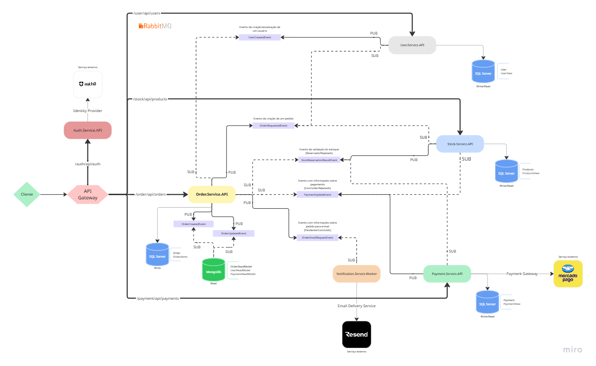

# 🛍️ Microsserviços E-Commerce em C# (.NET 8)

Projeto de estudo e referência para arquitetura de microsserviços com .NET 8, focado em desacoplamento, resiliência, observabilidade, mensageria orientada a eventos e autenticação centralizada.

## Visão Geral



Este repositório implementa um ecossistema de serviços para um domínio de e-commerce:

- `ApiGateways` (YARP Reverse Proxy)
- `Order`
- `Stock`
- `User`
- `Payment`
- `Auth`
- `Notification.Worker` (consumidor de eventos para envio de e-mails transacionais)
- `BuildingBlocks` compartilhados (mensageria, observabilidade, segurança, infraestrutura e contratos)

Os serviços seguem princípios de separação por responsabilidade, comunicação assíncrona por eventos (RabbitMQ) e composição de dados para leitura.

## Arquitetura e Padrões Utilizados

- Arquitetura em microsserviços com banco por contexto.
- `CQRS` com separação entre modelo de escrita e leitura.
- `MediatR` para orquestração de comandos e queries.
- `FluentValidation` para validação de entrada.
- `FluentResults` para padronização de retorno e erros.
- `Saga (Choreography)` baseada em eventos para fluxo de pedido.
- `API Composition` no serviço de `Order` para consolidar dados de `User` e `Payment`.
- `Event Sourcing` para projeções de leitura no MongoDB (read model de pedidos).
- `OCC (Optimistic Concurrency Control)` com RowVersion.
- `Repository Pattern` genérico + `Specification Pattern` para promover reutilização e manter a abordagem DRY.
- `Polly` no API Gateway (`Retry`, `Timeout`, `Circuit Breaker`).
- `Serilog` + `Seq` para observabilidade centralizada.
- `Auth0` para autenticação e autorização.
- `YARP` como gateway de entrada único.
- `Worker Service` para processamento assíncrono de notificações de e-mail.
- `Central Package Management` via `Directory.Packages.props`.

## Componentes de Infraestrutura

O `docker-compose.yml` sobe os componentes de apoio:

- `RabbitMQ` com Management UI
	- AMQP: `localhost:5672`
	- UI: `http://localhost:15672`
- `MongoDB`
	- `localhost:27017`
- `Seq`
	- UI: `http://localhost:5341`

Banco relacional dos serviços (`Order`, `Stock`, `User`, `Payment`) usa SQL Server via `127.0.0.1:1433` com `Integrated Security=True`.

## Serviços e Portas Locais

Configuração padrão de desenvolvimento:

- API Gateway: `http://localhost:5000`
- Order API: `http://localhost:5001`
- Stock API: `http://localhost:5002`
- User API: `http://localhost:5003`
- Auth API: `http://localhost:5004`
- Payment API: `http://localhost:5005`
- Notification Worker: sem porta HTTP (processo de background)

Roteamento via gateway (prefixo por domínio):

- `/order/{**}` -> `Order`
- `/stock/{**}` -> `Stock`
- `/user/{**}` -> `User`
- `/auth/{**}` -> `Auth`
- `/payment/{**}` -> `Payment`

## Pré-requisitos

Instale as ferramentas abaixo antes de executar o projeto:

1. .NET SDK 8 (`8.0.x`)
2. Docker Desktop
3. SQL Server local acessível em `127.0.0.1:1433` (autenticação integrada do Windows)
4. Git
5. (Opcional, recomendado para webhook externo) Ngrok

Integrações externas necessárias:

- Conta/Auth0 configurada para emissão e validação de JWT
- Token de acesso do Mercado Pago para o fluxo de pagamento

## Configuração

### 1) Restaurar dependências

Na raiz do repositório:

```bash
dotnet restore Ecommerce.sln
```

### 2) Configurar variáveis e credenciais

Revise os `appsettings.Development.json` de cada API e ajuste para seu ambiente:

- `Auth0:Domain`
- `Auth0:Audience`
- `Auth0:ClientId`
- `Auth0:ClientSecret`
- `MercadoPago:AccessToken`
- `MercadoPago:NotificationUrl`
- `ResendSettings:FromEmail` (worker de notificação)
- `ResendSettings:ApiKey` (worker de notificação)
- `RabbitMqSettings` (quando necessário sobrescrever host/credenciais padrão)
- `DatabaseSettings` e conexões com SQL Server

Recomendação: usar variáveis de ambiente ou Secret Manager para segredos, evitando persistir credenciais reais em arquivos versionados.

Observação importante para o `Notification.Worker`: o perfil local define `DOTNET_ENVIRONMENT=Development`. Garanta esse ambiente ao executar via CLI para carregar o `appsettings.Development.json` local (não versionado).

### 3) Subir infraestrutura de apoio

```bash
docker compose up -d
```

## Como Executar o Projeto

### Opção A: Visual Studio

Abra a solução `Ecommerce.sln` e inicie os projetos de API (`ApiGateways`, `Order.Api`, `Stock.Api`, `User.Api`, `Auth.Api`, `Payment.Api`) e o worker (`Notification.Worker`).

### Opção B: CLI (um terminal por serviço)

Na raiz do repositório, execute:

```bash
dotnet run --project ApiGateways/ApiGateways.csproj
dotnet run --project Services/Order/src/Order.Api/Order.Api.csproj
dotnet run --project Services/Stock/src/Stock.Api/Stock.Api.csproj
dotnet run --project Services/User/src/User.Api/User.Api.csproj
dotnet run --project Services/Auth/src/Auth.Api/Auth.Api.csproj
dotnet run --project Services/Payment/src/Payment.Api/Payment.Api.csproj
dotnet run --project Services/Notification/src/Notification.Worker/Notification.Worker.csproj
```

Observação: as migrações EF Core são aplicadas automaticamente no startup dos serviços de escrita.

## Fluxo Funcional (Resumo)

### 1) Autenticação

- `POST /auth/api/auth/login`
- Retorna token JWT para consumo dos endpoints protegidos.

Payload:

```json
{
	"email": "usuario@dominio.com",
	"password": "sua-senha"
}
```

### 2) Entidades principais

- Usuários: `/user/api/users`
- Produtos: `/stock/api/products`
- Pedidos: `/order/api/orders`
- Pagamentos: `/payment/api/payments`

### 3) Saga (Choreography) do pedido

Fluxo macro orientado a eventos:

1. `Order` cria pedido e publica `OrderRequestedEvent`.
2. `Stock` consome o evento e responde com `StockReservationResultEvent`.
3. `Payment` consome o resultado de estoque e cria intenção/checkout de pagamento.
4. Webhook do provedor é recebido no endpoint do `Payment` e persistido como `WebhookEvent` no banco de `Payment` (status inicial `Pending`).
5. Job recorrente do `Payment` (`webhook-processor-job`) busca webhooks pendentes e processa o pagamento de forma assíncrona.
6. `Payment` publica `PaymentUpdatedEvent`.
7. `Order` consome atualização e finaliza como `Completed` ou `Cancelled`.
8. Em falha de pagamento, `Order` publica `OrderFailedEvent` para ações compensatórias no `Stock`.
9. `Order` publica `OrderEmailRequestEvent` e o `Notification.Worker` envia e-mail conforme status (`Pending`, `Completed`, `Failed`).

## Background Service de Pagamento

O serviço `Payment` possui processamento em background com Hangfire:

- Dashboard: `http://localhost:5005/hangfire` (direto) ou `http://localhost:5000/payment/hangfire` (via gateway)
- Job recorrente: `expire-payments-job`
- Agendamento atual: a cada 12 minutos (`*/12 * * * *`)
- Job recorrente: `webhook-processor-job`
- Agendamento atual: a cada 10 segundos (`*/10 * * * * *`)

Responsabilidades do job:

- Buscar pagamentos expirados.
- Marcar como `Failed`.
- Publicar `PaymentUpdatedEvent` para propagar o novo estado para o `Order`.
- Buscar webhooks pendentes salvos no banco de `Payment`.
- Processar webhooks e atualizar seu status para `Processed` ou `Failed`.

## Worker de Notificação (E-mail)

O `Notification.Worker` processa envio de e-mails transacionais de forma assíncrona:

- Assina o evento `OrderEmailRequestEvent` via RabbitMQ.
- Resolve o template de e-mail por status do pedido.
- Envia e-mails com `Resend` (`Pending`, `Completed`, `Failed`).

Como executar somente o worker:

```bash
dotnet run --project Services/Notification/src/Notification.Worker/Notification.Worker.csproj
```

## Observabilidade e Saúde

- Health de cada serviço: `GET /health`
- Health consolidado via gateway: `GET http://localhost:5000/health`
- Logs estruturados com Serilog.
- Centralização de logs no Seq: `http://localhost:5341`.

## Testes

Executar todos os testes da solução principal:

```bash
dotnet test Ecommerce.sln
```

Executar apenas um serviço:

```bash
dotnet test Services/Order/Order.sln
dotnet test Services/Stock/Stock.sln
dotnet test Services/User/User.sln
dotnet test Services/Payment/Payment.slnx
```

## CI/CD

Pipeline GitHub Actions em `.github/workflows/dotnet-ci.yml`:

- Restore, build e testes com cobertura (`XPlat Code Coverage`)
- Estratégia de execução por alteração de contexto (matriz por solução)
- Build de imagem do API Gateway quando houver mudanças no gateway

## Troubleshooting Rápido

- Erro de conexão SQL Server: validar instância local em `127.0.0.1:1433` e permissões de autenticação integrada.
- Falha de autenticação JWT: revisar `Auth0:Domain` e `Auth0:Audience` em todos os serviços.
- Eventos não trafegam: verificar RabbitMQ (`http://localhost:15672`) e se os serviços estão ativos.
- Webhook não chega: validar URL pública no `MercadoPago:NotificationUrl` (Ngrok) e endpoint `/api/payments/webhook`.
- Logs ausentes no Seq: confirmar `Seq:Url` em `appsettings` e container `seq` em execução.

## Estrutura do Repositório

```text
ApiGateways/                  # Gateway com YARP e políticas de resiliência
BuildingBlocks/               # Componentes compartilhados
Services/
	Auth/
	Notification/
	Order/
	Payment/
	Stock/
	User/
docker-compose.yml            # RabbitMQ + MongoDB + Seq
Directory.Packages.props      # Central Package Management
Ecommerce.sln                 # Solução principal
```

